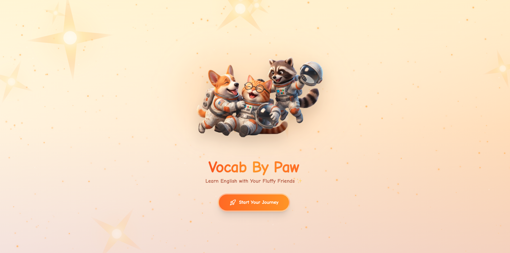
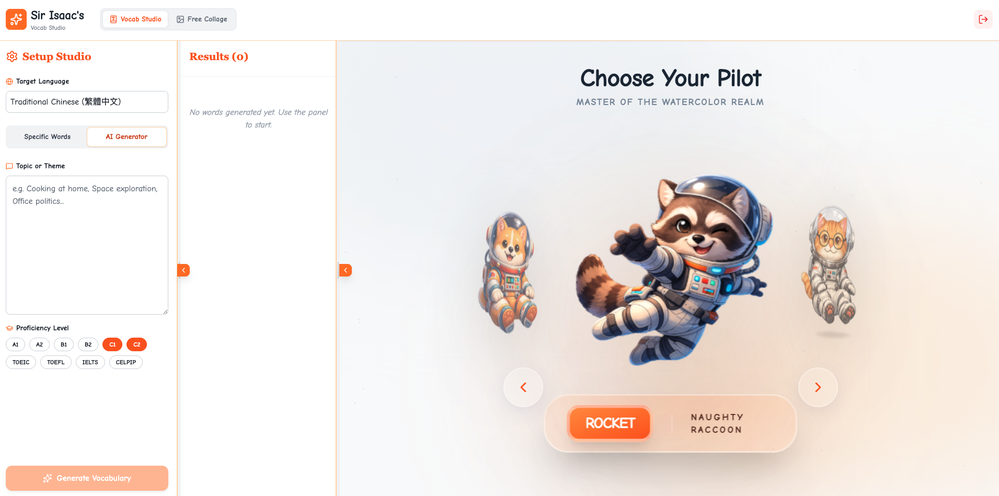
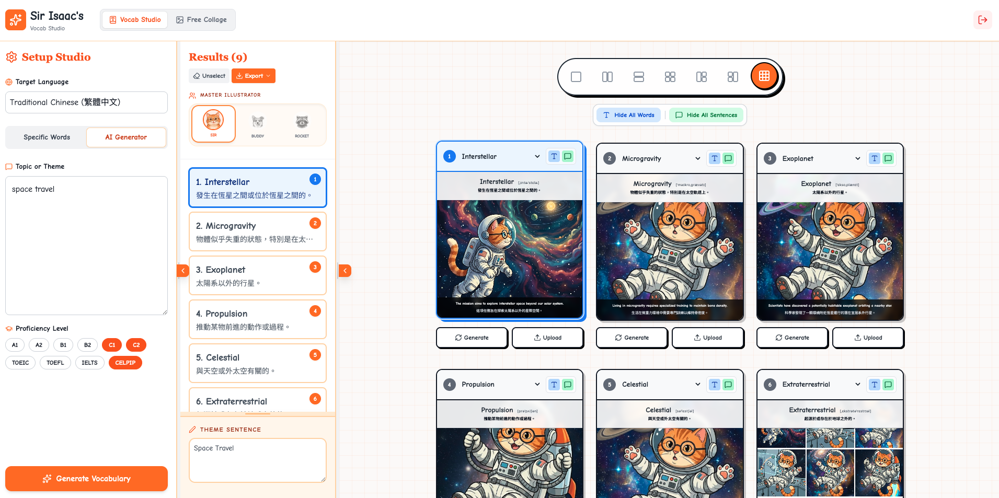

# 🐱 Sir Isaac's Vocab Studio

**Sir Isaac's Vocab Studio** is a creative, AI-powered vocabulary learning tool designed to make studying new words visually engaging and fun. Guided by "Sir Isaac" (a chubby orange tabby cat), users can generate vocabulary lists based on topics, create whimsical watercolor illustrations for each word, and arrange them into beautiful study cards or collages.

🔗 **Live Demo**: [https://vocab-by-paw.vercel.app](https://vocab-by-paw.vercel.app)

Powered by **Google Gemini 2.5 Flash** for text and **Gemini 2.5 Flash Image** for illustrations.

## 📸 Screenshots

### Homepage


### Dashboard - Vocab Studio


### Create Word Images



## ✨ Features

### 🧠 AI Vocabulary Generation
- **Topic-Based Generation**: Enter a theme (e.g., "Space Exploration", "Cooking") and select proficiency levels (A1-C2, TOEIC, etc.) to generate a curated list of words.
- **Manual Input**: Input specific words to get detailed definitions, KK phonetics, and example sentences.
- **Contextual Learning**: Every word comes with a definition and bilingual example sentences.

### 🖥️ Flexible Workspace
- **Resizable Panels**: Drag dividers to adjust panel widths.
- **Collapsible Drawers**: Maximize canvas area by collapsing side panels.
- **Mode Persistence**: Your last used mode (Vocab Studio / Free Collage) is remembered on reload.
- **Responsive Design**: Optimized UI for different screen sizes.

### 🎨 AI Image Studio
- **Auto-Generation**: "Soft watercolor and ink" style illustrations using Gemini 2.5 Flash Image.
- **Magic Editor**: Use natural language prompts to edit images (e.g., "Add a party hat").
- **Upload Support**: Upload your own images alongside AI-generated ones.
- **Drag & Drop Grid**: Arrange cards in various layouts (Single, Split, Grid 4, Grid 9, Focus views).

### 🎆 Free Collage Mode
- **Creative Freedom**: Build custom collages without vocabulary constraints.
- **Image Persistence**: All uploaded/generated images are cached in IndexedDB and restored on reload.

### 💾 Smart Caching
- **IndexedDB Storage**: Images are cached locally with larger capacity than localStorage (~50MB+).
- **Persistent State**: Vocabulary lists, grid layouts, and images persist across browser sessions.
- **Clean Logout**: All cached data is cleared on logout.

### 🛠️ Customization & Export
- **Smart Layouts**: Toggle text overlays, definitions, and sentences on cards.
- **Collage Stitching**: Stitch grid layouts into a single high-resolution PNG.
- **Line Styles**: Solid, Dashed, Dotted, Double, or Groove dividers.
- **Modern Color Picker**: Curated presets or rainbow gradient picker.
- **PDF Export**: Export vocabulary with images as a formatted PDF document.

## 🚀 Tech Stack

- **Frontend**: React 19, TypeScript, Vite
- **Styling**: Tailwind CSS
- **AI Integration**: Google GenAI SDK (`@google/genai`)
- **Storage**: IndexedDB for image caching
- **Routing**: React Router v6
- **Icons**: Lucide React
- **Font**: Comic Neue & Noto Sans TC
- **Deployment**: Vercel / Docker

## 🛠️ Getting Started

### Prerequisites
- Node.js (v18 or higher recommended) OR Docker
- A Google Cloud Project with the **Gemini API** enabled
- An API Key from [Google AI Studio](https://aistudio.google.com/)

### Installation

1. **Clone the repository**
   ```bash
   git clone https://github.com/AkiraP3/VocabByPaw.git
   cd VocabByPaw
   ```

2. **Configure Environment Variables**
   ```bash
   cp .env.example .env
   # Edit .env with your actual values
   ```

### Option A: Run with npm

```bash
npm install
npm run dev
```

Access at `http://localhost:3000`

### Option B: Run with Docker

```bash
docker-compose up -d
```

Access at `http://localhost:8080`

```bash
# View logs
docker-compose logs -f

# Stop
docker-compose down
```

## 🚀 Deployment

### Vercel (Recommended)

1. Push to GitHub
2. Import project in [Vercel Dashboard](https://vercel.com)
3. Add environment variables in **Settings → Environment Variables**:
   ```
   VITE_GEMINI_API_KEY = your_api_key
   VITE_USER = your_username
   VITE_PASS = your_password
   ```
4. Deploy automatically on every push

### Docker

Build and run with runtime environment injection (secrets not baked into image):

```bash
# Build image
docker build -t vocabbypaw .

# Run container
docker run -d -p 8080:80 \
  -e GEMINI_API_KEY=your_api_key \
  -e VITE_USER=your_username \
  -e VITE_PASS=your_password \
  vocabbypaw
```

Or use Docker Compose:

```yaml
# docker-compose.yml
version: '3.8'
services:
  vocabbypaw:
    build: .
    ports:
      - "8080:80"
    env_file:
      - .env
```

```bash
docker-compose up -d
```

## 📖 Usage

1. **Login**: Enter your credentials on the login page.
2. **Setup Panel**: Use the left panel to generate vocabulary words.
3. **Generate Words**: Choose a topic or enter manual words with target language.
4. **Select Layout**: Use the layout selector for different grid arrangements.
5. **Assign Words**: Click grid cells and select words from the list.
6. **Generate Images**: Click "Generate" on cells to create AI illustrations.
7. **Upload Images**: Alternatively, upload your own images.
8. **Export**: Stitch and download as PNG, or export as PDF.

## 🔒 Security Note

- **Local Development**: Using `.env` is fine.
- **Vercel**: Environment variables are injected at build time.
- **Docker**: Secrets are injected at runtime (not baked into image).
- **API Key Protection**: Set up **HTTP Referrer restrictions** on your API Key in Google Cloud Console.

## 📄 License

This project is open source under the MIT License.

